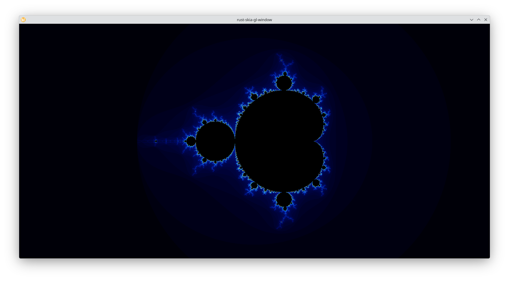
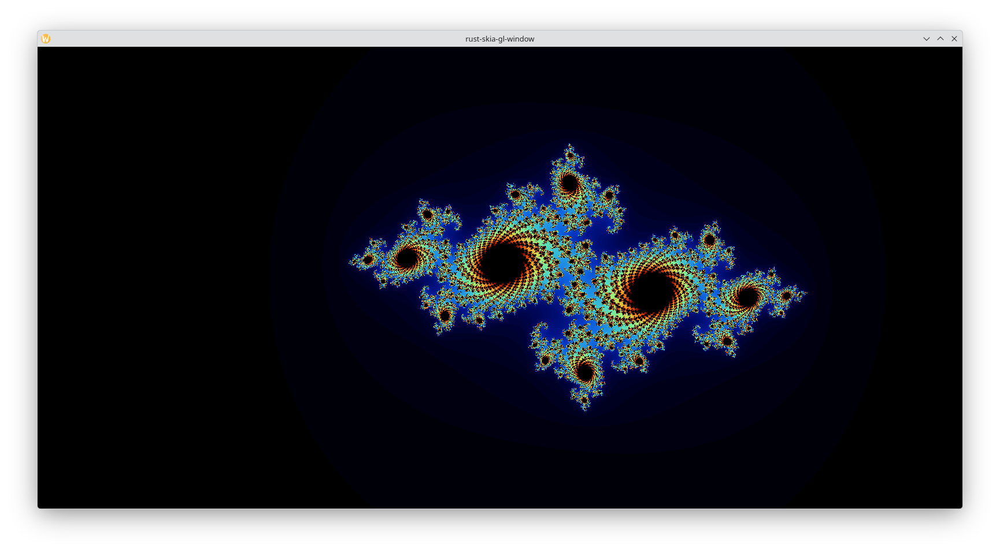
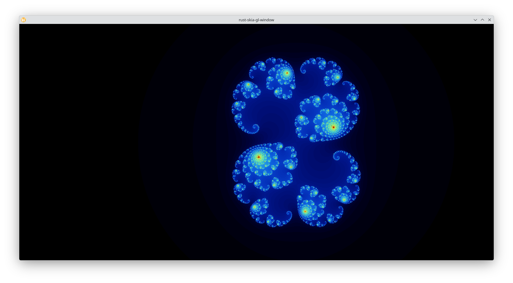
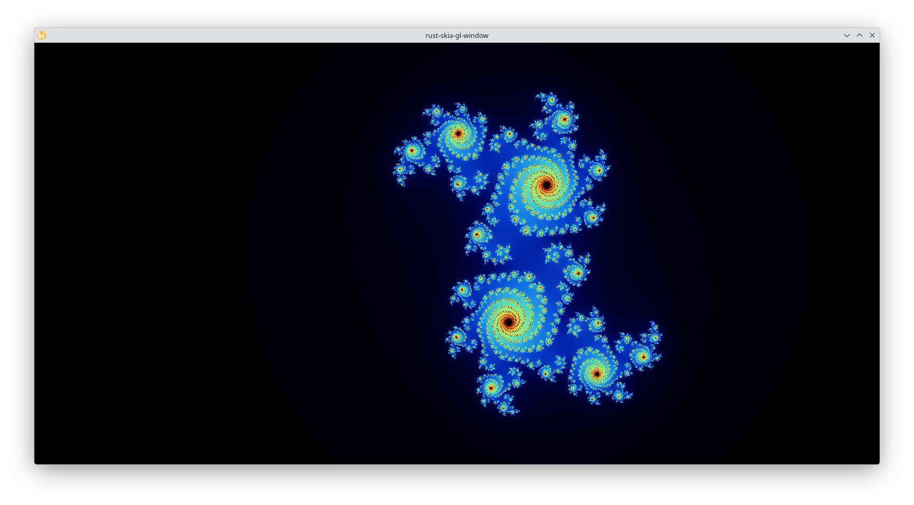
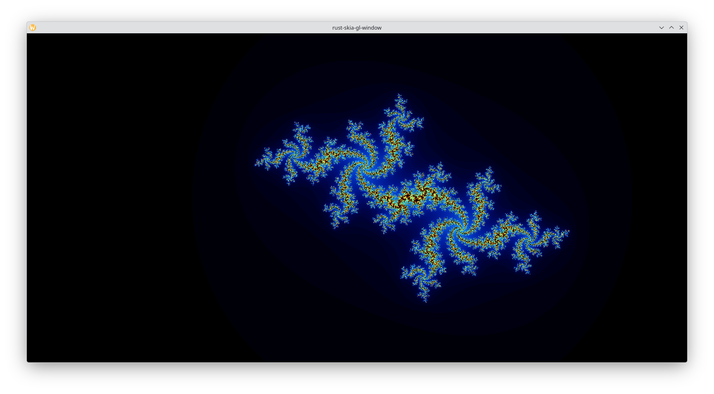
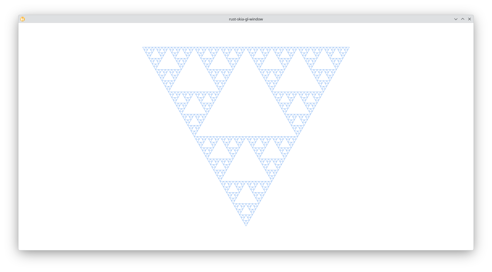
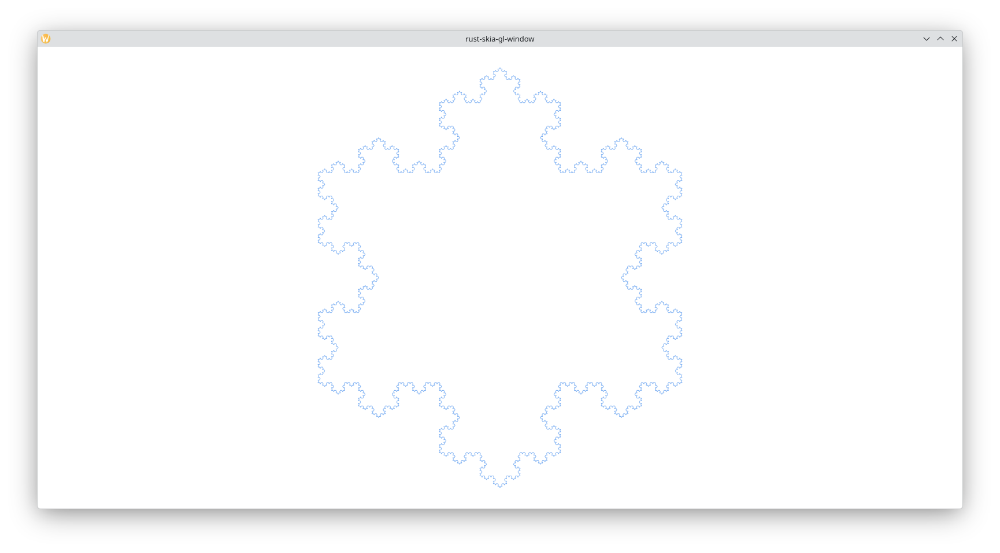
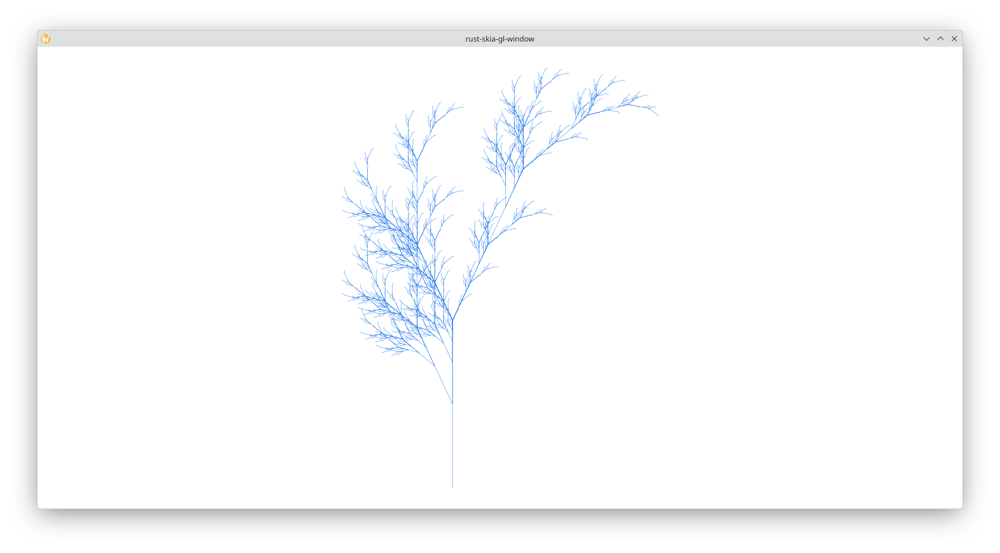

## mandelbrot-rs

Mandelbrot viewer written in Rust, using [Skia](https://skia.org/docs/) as the rendering engine and [skia-safe bindings for Rust](https://github.com/rust-skia/rust-skia)

- Mandelbrot: $z_0 = 0$, iterate $z = z^2 + c$ where $c$ varies per pixel
- Julia: $c$ is fixed, iterate $z = z^2 + c$ where $z_0$ varies per pixel

**Mandelbrot**

**Julia Set**

**Sierpinski Triangle**

**Koch Snowflake**

**Barnsley Fern**

